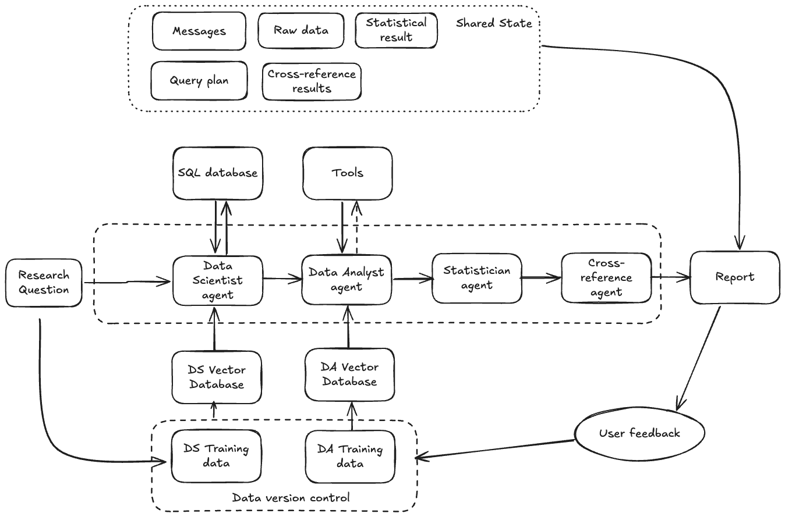

# 🧬 NextAgent Agentic AI

An intelligent, multi-agent AI system for protein expression analysis and cancer research, powered by advanced language models and automated statistical analysis.



## 🚀 Overview

NextAGent is a agentic AI platform that revolutionizes protein expression analysis through the coordination of specialized AI agents. The system combines natural language processing, automated SQL generation, statistical analysis, and literature cross-referencing to provide comprehensive insights into protein biomarkers and cancer research.

### Key Capabilities

- **🤖 Multi-Agent Architecture**: Coordinated AI agents with specialized roles
- **💬 Natural Language Queries**: Ask research questions in plain English
- **📊 Automated Statistical Analysis**: Built-in t-tests, ROC analysis, and more
- **📚 Literature Cross-Referencing**: Automatic validation against scientific literature
- **🧪 Protein Database Integration**: Complete UniProt protein information
- **🎯 Cancer Research Focus**: Specialized workflows for oncology research
- **📈 Interactive Visualizations**: Real-time charts and data exploration
- **🔗 Flexible LLM Support**: Works with both proprietary and open-source models

## 🏗️ System Architecture

The NextAgent system employs a sophisticated multi-agent architecture orchestrated by LangGraph:

### Core Agents

1. **Data Scientist Agent** 🔍
   - Converts natural language questions to SQL queries
   - Uses Vanna (LLM-powered SQL generator) with ChromaDB vector store
   - Retrieves relevant protein expression data from the database

2. **Statistician Agent** 📊
   - Performs automated statistical analyses
   - Supports t-tests, ROC AUC calculations, fold-change analysis
   - Handles vectorized operations for performance optimization

3. **Analysis Agent** 🧠
   - Extracts key proteins from statistical results
   - Prioritizes findings based on significance and effect size
   - Formats results for downstream processing

4. **Cross-Reference Agent** 📖
   - Validates findings against scientific literature
   - Provides evidence-based insights and citations
   - Identifies potential novel biomarkers

### Workflow Pipeline

```
Research Question → Data Scientist → Statistician → Analysis → Cross-Reference → Final Report
```

The LangGraph orchestrator manages state between agents and ensures seamless data flow through the pipeline.

## 🛠️ Installation

### Prerequisites

- Python 3.11+
- Git
- Virtual environment (recommended)

### Quick Start

1. **Clone the repository**
   ```bash
   git clone <repository-url>
   cd nextgen
   ```

2. **Set up virtual environment**
   ```bash
   python -m venv .venv
   source .venv/bin/activate  # On Windows: .venv\Scripts\activate
   ```

3. **Install dependencies**
   ```bash
   pip install -r requirements.txt
   # OR using uv (Recommended)
   uv sync
   ```

4. **Configure environment variables**
   Create a `.env` file in the root directory:
   ```bash
   # For MD Anderson LLM (if applicable)
   APIM_SUBSCRIPTION_KEY=your_md_anderson_key
   
   # For OpenAI (if using)
   OPENAI_API_KEY=your_openai_key
   ```

5. **Initialize the database**
   ```bash
   cd construct_database
   python init_database.py
   ```

6. **Download and set up protein data** (optional)
   ```bash
   python simple_uniprot_downloader.py
   python add_proteins_db.py
   ```

## 📊 Database Setup

The system uses a SQLite database with three main tables:

### 1. Proteins Table
- **Source**: UniProt canonical human proteins
- **Fields**: Entry ID, protein names, gene names, function, domains, etc.
- **Size**: ~20,000 human proteins with comprehensive annotations

### 2. Measurement Table
- **Source**: Protein expression measurements
- **Fields**: Protein groups, intensities, sample IDs, modification states
- **Format**: Long format for efficient querying

### 3. Sample Table
- **Source**: Sample metadata
- **Fields**: Cancer types, patient demographics, clinical annotations
- **Purpose**: Enables stratified analysis and cohort comparisons

### Database Construction

```bash
# Initialize empty database
python construct_database/init_database.py

# Download UniProt data (optional - takes time)
python construct_database/simple_uniprot_downloader.py

# Add protein annotations
python construct_database/add_proteins_db.py

# Add measurement data
python construct_database/add_measurement_table.py

# Add sample metadata
python construct_database/add_sample_table.py
```

## 🎮 Usage

### Interactive Chat Interface

Launch the Gradio web interface for interactive analysis:

```bash
python src/nextgen/chat/gradio_chat.py
```

Navigate to `http://localhost:7860` and start asking research questions like:

- "What proteins are important for distinguishing breast cancer from other cancer types?"
- "Find biomarkers for lung cancer with statistical significance"
- "Compare protein expression between tumor and normal samples"

### Programmatic Usage

#### Using the Research Graph

```python
from nextgen.langgraph.research_graph import ResearchGraph

# Initialize the research pipeline
graph = ResearchGraph()

# Ask a research question
question = "What proteins are differentially expressed in breast cancer?"
answer = graph.run(question)

print(answer)
```

#### Using Individual Agents

```python
from nextgen.agents import (
    get_data_scientist_agent,
    get_statistician_agent,
    get_analysis_agent,
    get_cross_reference_agent
)

# Data retrieval
data_scientist = get_data_scientist_agent()
raw_data, sql = data_scientist.analyze("Find breast cancer proteins")

# Statistical analysis
statistician = get_statistician_agent()
stats_result = statistician.analyze("Perform t-test analysis", raw_data)

# Extract key proteins
analysis_agent = get_analysis_agent()
proteins = analysis_agent.analyze(question, sql, stats_result)

# Literature validation
cross_ref = get_cross_reference_agent()
final_report = cross_ref.analyze(question, proteins)
```

### Command Line Usage

```bash
# Run basic analysis
python chat.py

# Train data scientist agent
python train/train_data_scientist.py

# Run statistical analysis
python src/nextgen/analysis/t_test.py
```

## 🧪 Examples

### Example 1: Cancer Biomarker Discovery

```python
question = "What proteins distinguish pancreatic cancer from healthy tissue?"

# The system will:
# 1. Based on the research question, split it into small steps and generate detailed query plan, saving research question to the shared state.
# 2. Generate database-dependent SQL to query relevant data, saving SQL and raw data to shared state. 
# 3. Perform the right statistical tests (t-tests, ROC analysis)
# 4. Identify significant proteins
# 5. Cross-reference with literature
# 6. Generate a comprehensive report with evidence

** At each step, important information and intermidate data are saved into a shared state, and agent perform the appropriate operation based on comprehensive understanding of the information stored in the shared state. 
```


## 🔧 Configuration

### Model Selection

Configure which LLM to use in your agents:

```python
# Use MD Anderson LLM
# you can set you own proprietary LLM model based the code used to set "md_anderson"
agent = get_data_scientist_agent(model="md_anderson")

# Use OpenAI
agent = get_data_scientist_agent(model="openai")
```

### Database Paths

Customize database and vector store locations:

```python
graph = ResearchGraph(
    db_path="path/to/your/database.db",
    chroma_path="path/to/vector/store",
    checkpoint_path="path/to/checkpoints.db"
)
```

### Statistical Parameters


## 📁 Project Structure

```
nextgen/
├── src/nextgen/           # Main source code
│   ├── agents/           # AI agent implementations
│   ├── langgraph/        # Workflow orchestration
│   ├── chat/             # Web interface
│   ├── analysis/         # Statistical methods
│   ├── openai/           # LLM client implementations
│   ├── pandas/           # Data processing utilities
│   └── vanna/            # SQL generation
├── construct_database/   # Database setup scripts
├── data/                 # Raw data files
├── database/            # SQLite database and vector stores
├── notebooks/           # Jupyter notebooks for exploration
├── train/               # Agent training scripts
├── exports/             # Output files and visualizations
└── requirements.txt     # Python dependencies
```

## 🔬 Scientific Applications

### Cancer Research
- Biomarker discovery across cancer types
- Differential expression analysis
- Pathway enrichment studies

### Protein Function Studies
- Post-translational modification analysis
- Protein-protein interaction networks
- Subcellular localization patterns
- Disease association studies

## 🤝 Contributing

We welcome contributions! Please see our contributing guidelines:

1. Fork the repository
2. Create a feature branch
3. Make your changes
4. Add tests for new functionality
5. Submit a pull request


## 📄 License

This project is licensed under the MIT License - see the [LICENSE](LICENSE) file for details.

**Built with ❤️ for the scientific community**
